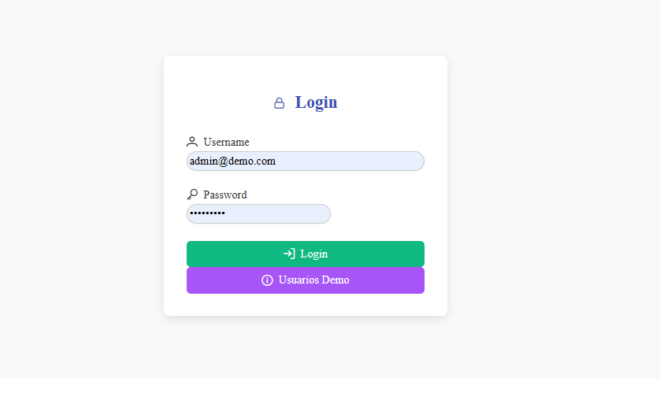
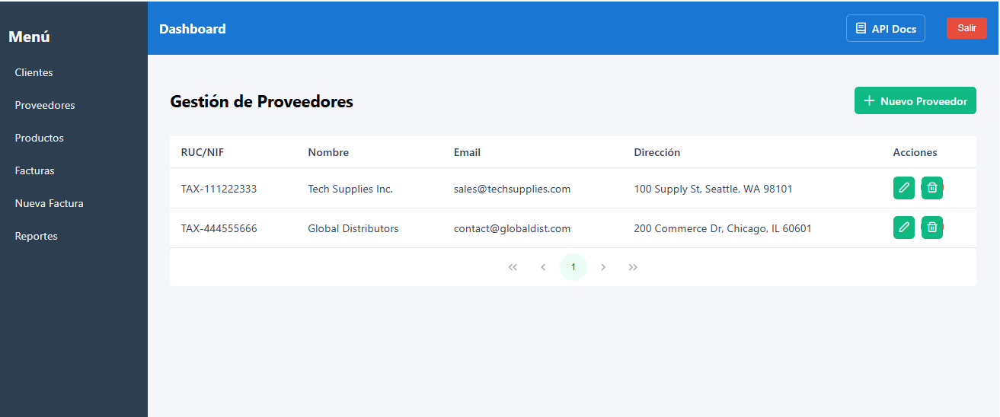
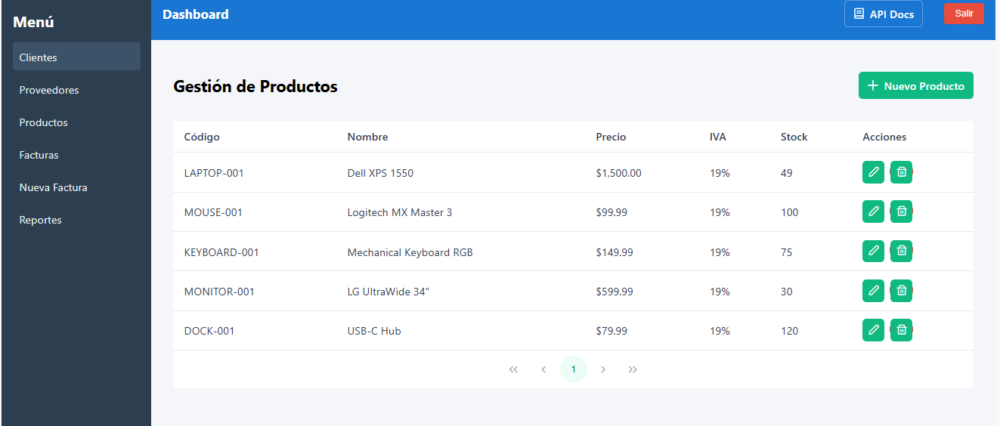
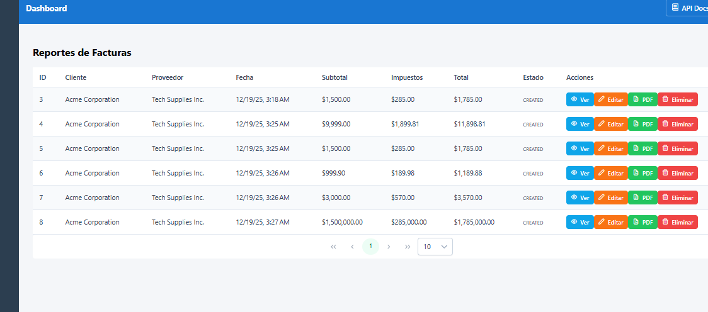
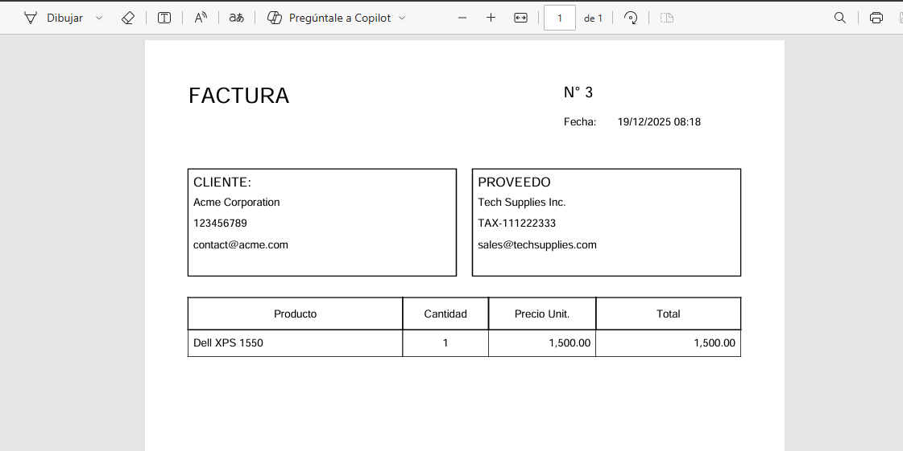
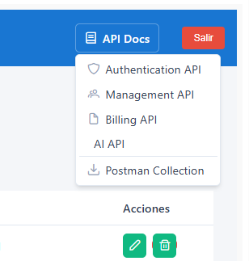
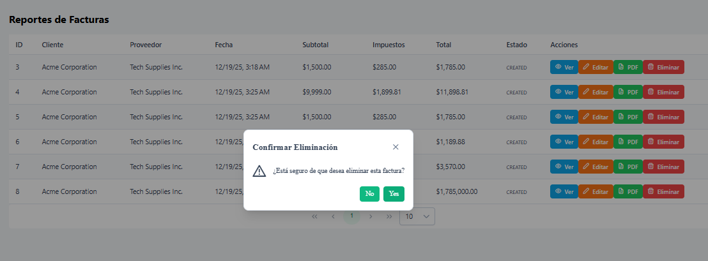

# 🧾 Microbill - Complete Billing System

Enterprise billing system with **microservices architecture**, **integrated AI** and **modern Angular frontend**.

## 🚀 Quick Start with Docker

### Single command execution:

**Windows:**
```bash
start.bat
```

**Linux/Mac:**
```bash
chmod +x start.sh
./start.sh
```

### Manual configuration:
```bash
# 1. Copy configuration
cp .env.example .env

# 2. Start all services
docker-compose up --build -d

# 3. Check status
docker-compose ps
```

## 🏗️ Microservices Architecture

### 🔹 Backend Services (Java 21 + Spring Boot 3)
- **🔐 Auth Service** (8081): JWT Authentication, users, roles
- **📊 Management Service** (8082): CRUD Customers, Providers, Products  
- **🧾 Billing Service** (8083): Invoices, items, PDF reports, events
- **🤖 AI Service** (8084): Python + FastAPI - Recommendations and anomaly detection

### 🔹 Frontend (Angular 21 + PrimeNG)
- **🎨 Frontend** (4200): SPA with lazy loading, guards, interceptors

### 🔹 Infrastructure
- **🗄️ MySQL**: Shared database
- **🐰 RabbitMQ**: Asynchronous messaging
- **🐳 Docker**: Complete containerization

## ✨ Implemented Features

### ✅ **Authentication and Security**
- JWT Login
- Guards and interceptors
- Demo users: `admin@demo.com/Admin#123`, `user@demo.com/User#123`

### ✅ **Complete Management (CRUD)**
- **Customers**: Name, document, email, address
- **Providers**: Name, RUC/NIF, email, address  
- **Products**: Code, name, price, stock, taxes
- **Invoices**: Items, automatic calculations, statuses

### ✅ **Smart Billing**
- Dynamic form with real-time calculation
- Automatic Subtotal, VAT/Taxes, Total
- Validations and stock controls

### ✅ **Artificial Intelligence**
- **Recommendations**: Suggested products by customer
- **Anomaly Detection**: Risk score and explanation
- Side panel with real-time suggestions

### ✅ **Reports and Events**
- PDF generation (prepared for JasperReports)
- `InvoiceCreated` events with RabbitMQ
- Direct download from frontend

## 🚀 Installation and Execution

### Prerequisites
- Docker & Docker Compose
- Java 21 (for local development)
- Node.js 18+ (for local development)
- Python 3.11+ (for local development)

### 🐳 **Complete Docker Execution**
```bash
# Clone repository
git clone <repository-url>
cd core-microbill-challenge

# Start all infrastructure
docker-compose up -d

# Check services
docker-compose ps
```

### 🔧 **Local Development**
```bash
# 1. Infrastructure
docker-compose up -d mysql rabbitmq

# 2. Backend Services
cd backend/microbill-authentication-service && mvn spring-boot:run
cd backend/microbill-management-service && mvn spring-boot:run  
cd backend/microbill-billing-service && mvn spring-boot:run

# 3. AI Service (Python)
cd backend/microbill-billing-ia
pip install -r requirements.txt
python main.py

# 4. Frontend (Angular)
cd frontend
npm install
npm start
```

## 🌐 **Service Access**

| Service | URL | Description |
|---------|-----|-------------|
| **Frontend** | http://localhost:4200 | Angular Application |
| **Auth API** | http://localhost:8081/swagger-ui/index.html | Authentication |
| **Management API** | http://localhost:8082/swagger-ui/index.html | CRUD Management |
| **Billing API** | http://localhost:8083/swagger-ui/index.html | Billing |
| **AI API** | http://localhost:8084/docs | Artificial Intelligence |
| **RabbitMQ** | http://localhost:15672 | Management UI |

## 📋 **Main Endpoints**

### 🔐 Authentication
```
POST /api/auth/login → JWT Token
```

### 📊 Management
```
GET/POST/PUT/DELETE /api/customers
GET/POST/PUT/DELETE /api/providers  
GET/POST/PUT/DELETE /api/products
```

### 🧾 Billing
```
GET/POST/PUT/DELETE /api/invoices
POST /api/invoices/{id}/generate-report → PDF
```

### 🤖 Artificial Intelligence
```
POST /api/ai/recommendations?customerId={id} → Suggested products
POST /api/ai/anomaly-score → Anomaly detection
```

## 🎯 **User Flow**

1. **Login** → JWT Authentication
2. **Dashboard** → System overview
3. **Management** → CRUD of Customers, Providers, Products
4. **Billing** → Create invoices with integrated AI
   - Select customer and provider
   - Add products (with AI recommendations)
   - Automatic total calculations
   - Real-time anomaly detection
   - Generate and download PDF
5. **Reports** → Document visualization and download

## 🧠 **AI Features**

### Smart Recommendations
- Purchase history analysis
- Personalized customer suggestions
- Real-time form integration

### Anomaly Detection
- Risk score (0-100%)
- Atypical pattern analysis

## 🏛️ **Technical Architecture**

### Backend (Hexagonal + Contract-First)
- **Domain**: Entities with business logic
- **Ports**: Use case interfaces
- **Adapters**: Implementations (REST, JPA, RabbitMQ)
- **OpenAPI**: Automatic DTO generation

### Frontend (Angular + PrimeNG)
- **Lazy Loading**: On-demand modules
- **Reactive Forms**: Reactive forms
- **Guards**: Route protection
- **Interceptors**: Automatic JWT handling
- **Services**: Microservice communication

### Communication
- **HTTP REST**: Between frontend and backend
- **RabbitMQ**: Asynchronous events
- **JWT**: Stateless authentication

## 📦 **Technologies**

### Backend
- Java 21, Spring Boot 3.5.8
- MySQL 9.4, JPA/Hibernate
- RabbitMQ, JWT
- MapStruct, Lombok
- JasperReports, OpenAPI

### Frontend  
- Angular 21, TypeScript
- PrimeNG, RxJS
- Reactive Forms, Guards
- Docker, Nginx

### AI & DevOps
- Python 3.11, FastAPI
- NumPy, Pandas, Scikit-learn
- Docker Compose
- MySQL, RabbitMQ

## 🎨 **Screenshots**

### Login


### Main Dashboard


### Provider Management


### Product Management


### Create Invoice


### Invoice List


### Invoice View


### Reports


### Reports and Modifications


### Report Generation


### Documentation


### Delete Confirmation


## 📁 **Additional Resources**

### Postman Collection
- **File**: `Microbill_API_Collection.postman_collection.json`
- **Description**: Complete collection to test all endpoints
- **Includes**: Authentication, complete CRUD, AI, and test cases
- **Variables**: Automatic token and ID configuration

### Import in Postman
1. Open Postman
2. Import → Select file `Microbill_API_Collection.postman_collection.json`
3. Configure environment variables if needed
4. Execute requests in order (Login first)

## 📈 **Future Improvements**

- [ ] CI/CD with GitHub Actions
- [ ] Observability with Prometheus/Grafana
- [ ] Push notifications


---